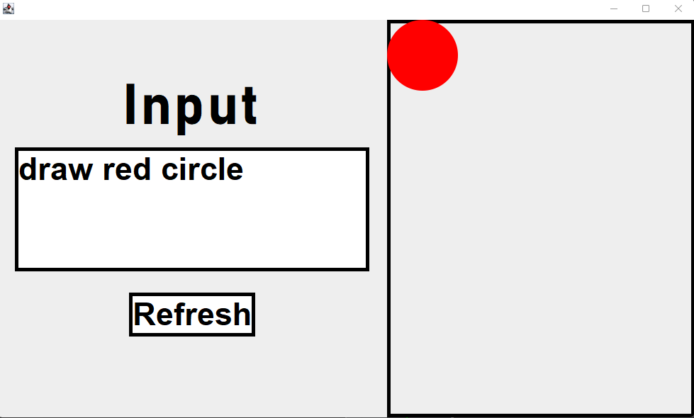
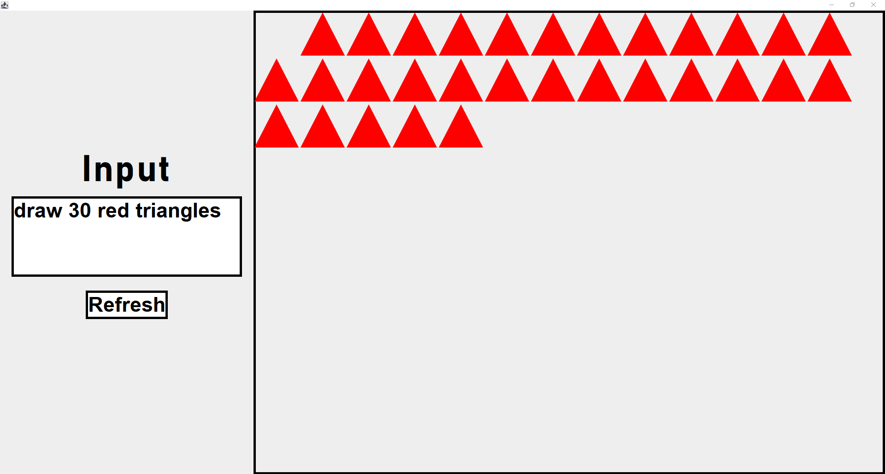

# Text To Image

Malt ein Bild nach Textanweisungen. Außerdem achtet das Programm auf einen richtigen Satzbau.
## Male ein Objekt

## Male mehrere Objekt

## Achte auf den richtigen Satzbau

## Male mehrere Objekte im Vollbild Format (Resizing)

